SOX + Bigsky local setup
=========

The following is a guide to setup SOX(inabox) and bigsky locally such that you can test the attachments panel against "real" endpoints. To get started, make sure you have cloned the following repositories on your local machine : 

- bigsky : [git@github.com:Workiva/bigsky.git](git@github.com:Workiva/bigsky.git)
- sox (inabox) : [git@github.com:Workiva/sox.git](git@github.com:Workiva/sox.git)
- graph_app : [git@github.com:Workiva/graph_app.git](git@github.com:Workiva/graph_app.git)

***

## SOX inabox

First, follow the setup instructions included in the repo [here](https://github.com/Workiva/sox/blob/master/README.md).

Afterwards, you could simply run `./run.sh --persist-data` to stand up sox and all of its dependent containers (bigsky in a box, grc service etc...). Because we want to run this against a local bigsky instance, there's some changes we'll need.

#### Disable builtin bigsky

To disable the builtin 'bigsky-in-a-box' that ships with sox, open `bigsky-compose.yml` and comment out the 'bigsky' service and the 'certs-hack' service. Then find and remove all of the 'depends on' -> bigsky in the other yml files: 

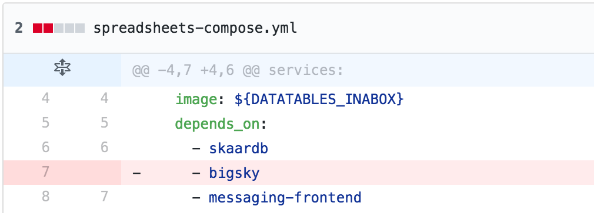

#### CORS Fix

Since we're running bigsky locally on port 8001, you'll need to change the `CORS_ALLOWED_ORIGIN` settings in graph-compose.yml and add 'http://localhost:8001' to every line that has port 8100:

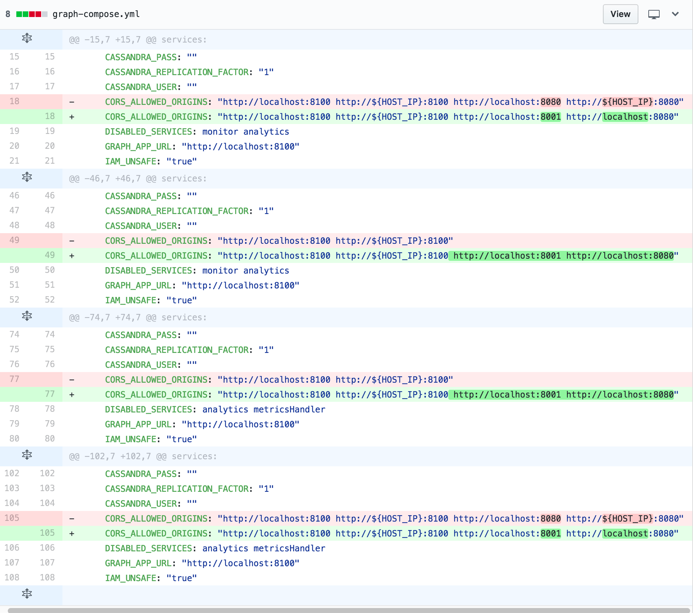

These should be the only changes necessary in your local sox-in-a-box clone to run sox against your local bigksy instance. 

***

## Bigsky

To begin, follow the usual setup instructions for bigsky found in the [bigsky readme](https://github.com/Workiva/bigsky/blob/master/README.md) or the [dev portal](https://dev.workiva.net/docs/product/bigsky/dev-environment). 


#### Attachments

1. Enable the account setting named `Annotation Attachments`
2. If you're using wk-dev's file services, you'll need to setup an ngrok tunnel. Alternatively, the sox-in-a-box has a running file-services instance in the sox_prs_1 container. If you chose to leverage that, skip the ngrok setup, and setup your file services hostname to be : `localhost:8090`. For this to work you'll also need to set your `File Services Callback Hostname` to `<host_ip>:8001`.

- ##### ngrok

    `brew cask install ngrok`
    
    `ngrok http localhost:<port>`

    You should now see a screen that looks like : 
    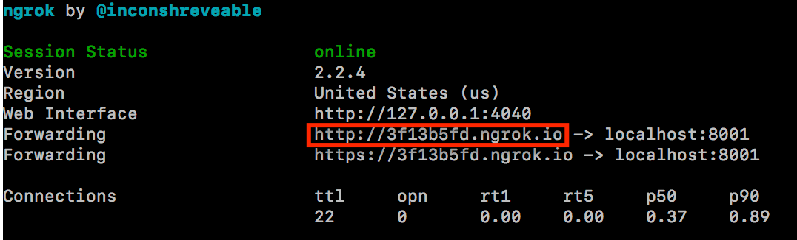

    Copy the values circled in red and use it to update the following in settings.py (or settingslocal.py) : 
    
    `BASE_URL_OVERRIDE = "http://3f13b5fd.ngrok.io"`
    `REQUESTED_BASE_URL_OVERRIDE = BASE_URL_OVERRIDE`

    :point_up: be sure to use the http value, not the https

     Now run your bigsky server on the same port (8001) :

    `dev_appserver.py --host 0.0.0.0 --port 8001 --blobstore_path <bs_path> --datastore_path <ds_path> --log_level debug dispatch.yaml bigskyf1.yaml bigskyf4.yaml validationf1.yaml app.yaml ../py-iam-services/iam-services.yaml`

     With your bigsky server running, navigate to the server admin settings page [http://localhost:8001/serveradmin/settings](http://localhost:8001/serveradmin/settings) and update the following: 
 
     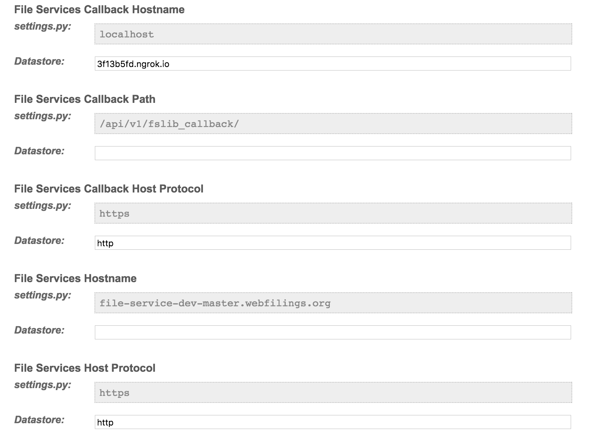
     
     :point_up: Notice that for the 'File Services Callback Hostname' setting, the http:// is NOT included.


#### OAuth2 Setup

Because SOX runs a lot of containers that provide services to it and bigsky, we'll need to add those applications under our bigsky oauth2 settings. Navigate to [http://localhost:8001/serveradmin/oauth2](http://localhost:8001/serveradmin/oauth2/). When complete, your list of apps should look like : 

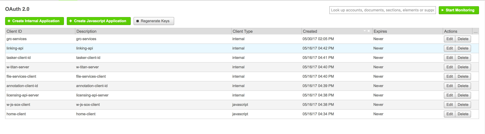. 

There are two ways to acheive this:
##### Erase Reset
Copy the config yml files from the sox/bigsky/ directory, and move them to your bigsky/tools/bulkdata directory (overriding the yml files there). Then update the key paths in the copied files to point back to your sox/keys/ directory. Lastly, run your erase reset script and you should then have all the js and internal apps setup.

##### Non-Erase Reset
Alternatively, if you don't want to lose your datastore, you could do this manually by going through the following :  

For each of the 'internal' client types, you'll need to get a key from your sox directory. For example, the `grc-services` public key can be retrieved by navigating to your local `<sox-in-a-box path>/keys` directory in your terminal. Once there do the following: 

`pbcopy < grc-services.pub`

:point_up: note that for all of the oauth2 app settings, we'll want the .pub keys (public keys), not the .pem keys. 

Once you've copied the key, you can paste it in the app config : 

#### Internal Clients: 

- ##### grc-services
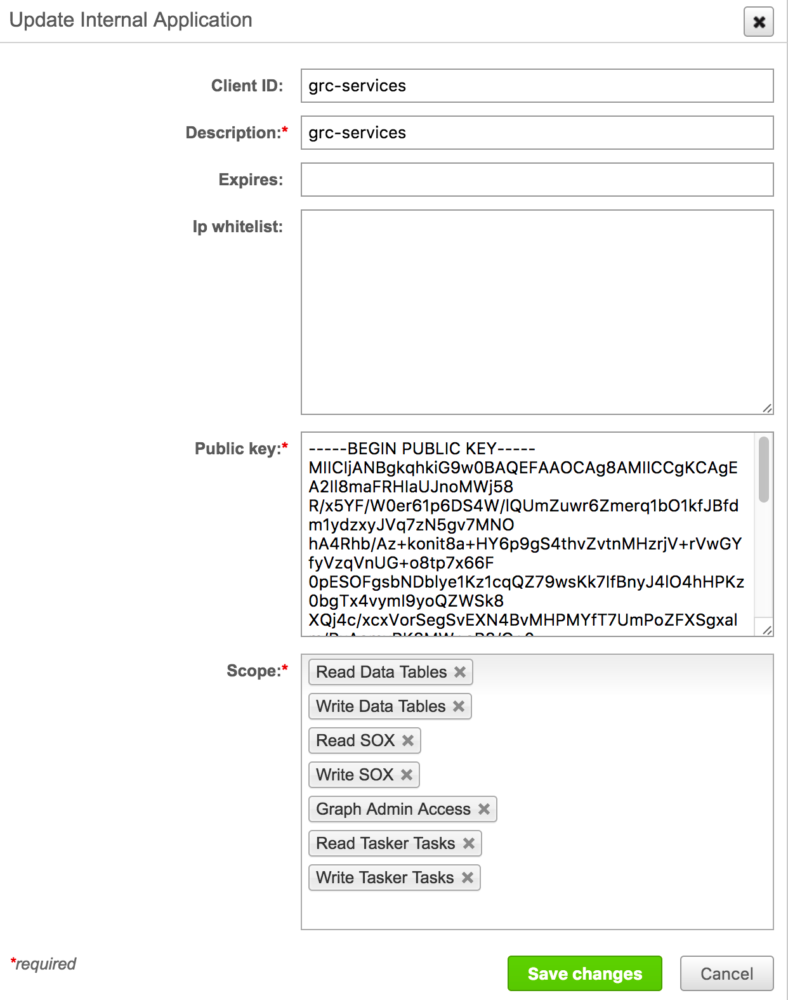

- ##### linking-api
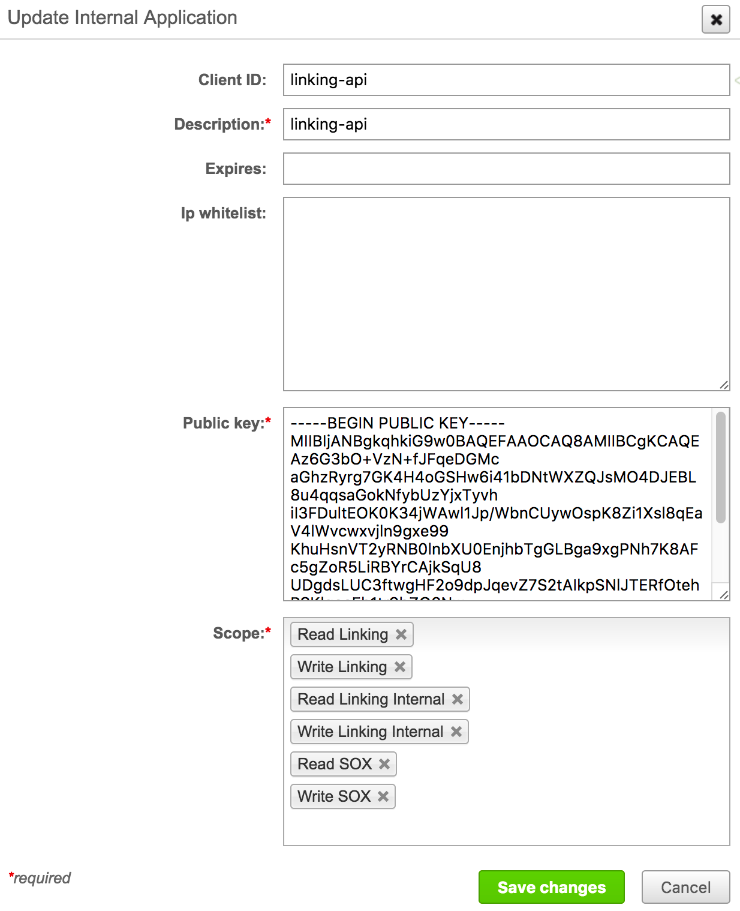

- ##### tasker-client-id
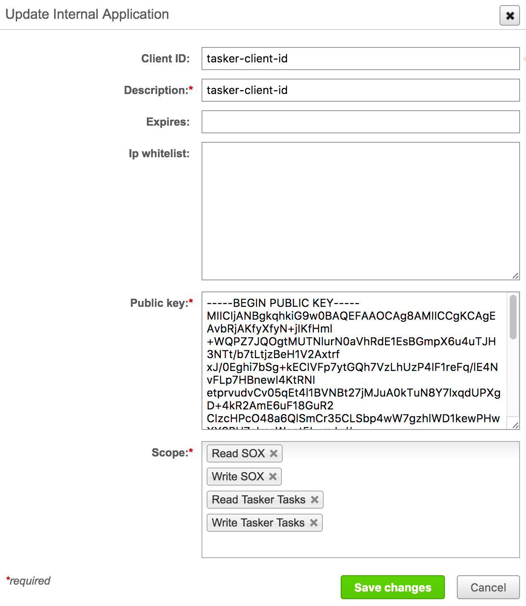

- ##### w-titan-server
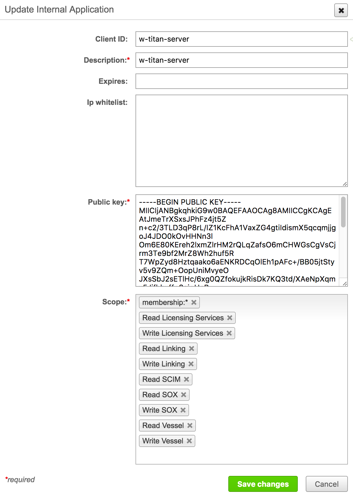

- ##### file-services-client
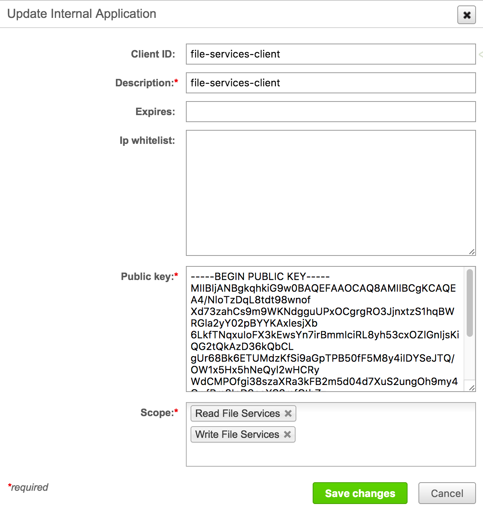

- ##### annotation-client-id
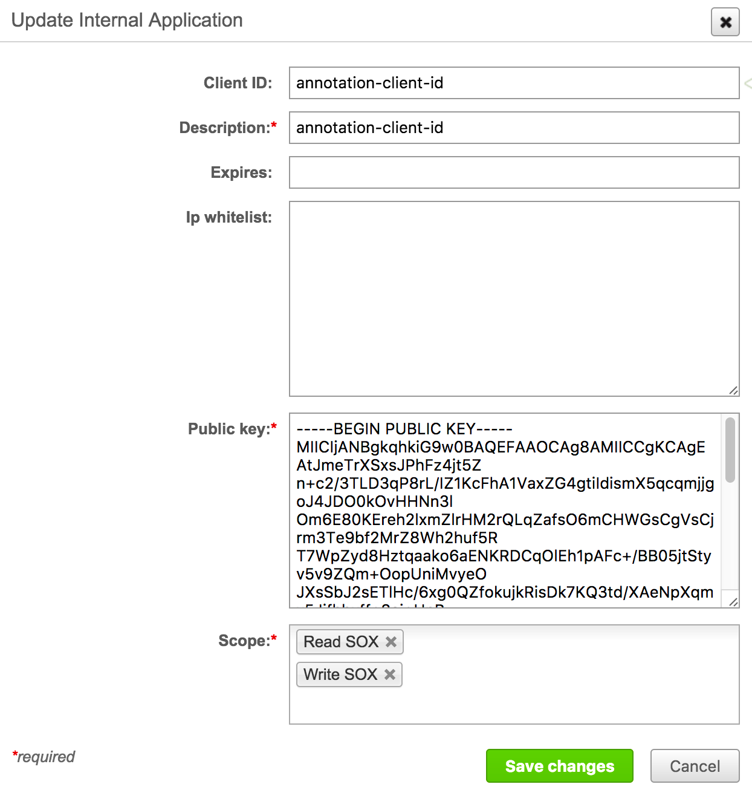

- ##### licensing-api-server
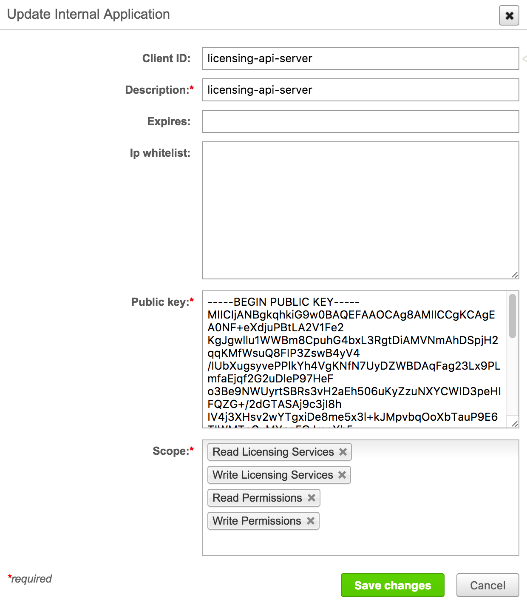

#### Javascript clients

For the javascript client configs, you'll need to know you're machine's IP address. This can be retreived by right-clicking your network config on the top-right toolbar or by running `ifconfig` in a terminal. After you know you're IP address, update the 'allowed origins' of each javascript application to match the following:

- ##### w-js-sox-client
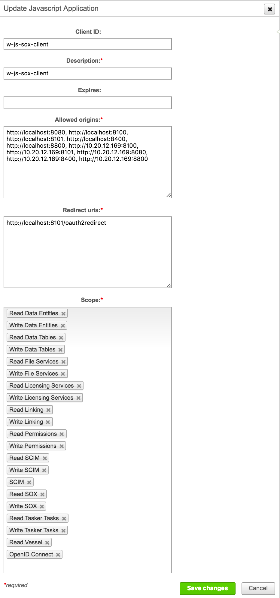

- ##### home-client
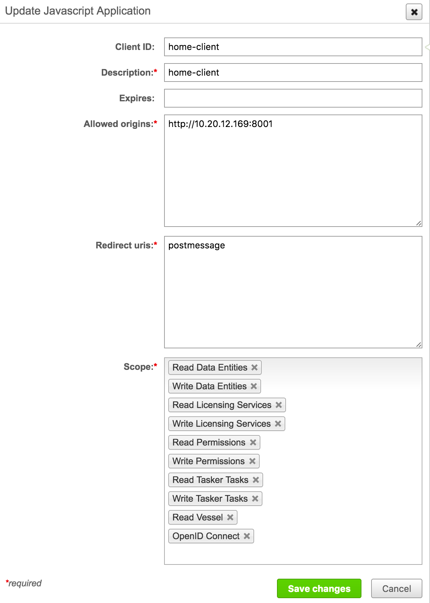

#### Private Keys

There are two private keys necessary to wrap up the oauth config. In your bigsky app, navigate to [http://localhost:8001/serveradmin/settings/](http://localhost:8001/serveradmin/settings/). Look for the setting named `RSA512 Private Key to identify bigsky to our Identity and Access Management service`. That value should be copied from `<sox_path>/keys/bigsky-client.pem`. 

The other setting is `Private Key for Tasker Client Oauth2` and that value should be copied from `<sox_path>/keys/tasker-client.pem`

Once saved, those settings should handle all the oauth for sox. 

#### SOX Settings

In your server settings, verify `Enable SOX` is set to `True`.

Also, verify in your server settings, that `GRC Tasker Service URL` is set to : `http://localhost:8171/frugal/tasker/`

In your account settings, verify the following are all `True`/`Yes`:

- `Annotation Attachments`
- `Enable SOX`
- `Enable SOX Direct Nav`
- `Enable SOX Testing`
- `Enable roles and capabilities licensing framework`

***

## Graph_app

Follow the setup instructions included in the repo [here](https://github.com/Workiva/graph_app/blob/master/README.md).

Afterwards, its retively trivial to point graph_app's w_attachment dependency to a dev branch : 

`pubspec.yaml` file : 
```yml
  w_attachments:
    git:
      url: git@github.com:paulankenman-wf/w_attachments.git
      ref: ATEAM-3359
```

After that, graph_app should be ready to go, run it by executing the following in your terminal : `make serve-local`

***

## Graph Setup

With sox, bigsky, and graph_app all running, navigate (in dartium) to [http://localhost:8080/?debug=true](http://localhost:8080/?debug=true) Once there, top left should be a create button with an "import from account option". Import [this](../docs/sox_example_data/get_attribute_matrices.bin) example data or any other pre-made graph. :point_up: This import sometimes will fail, just re-run it until it passes.

Once imported, you'll need to commit the model; click the model page bottom left nav item, and then click 'commit' (top right). 

After the model is committed, you'll need to setup your user in the graph. Navigate to 'Data', on the left nav, then select data type 'person'. In the new person screen, the only field you should have to edit is the bottommost 'is user\' field. Enter your username there and you should see it auto-complete. Once done, save your new graph person. 

Now that you've got a person in the graph, you need to give your person the correct roles. Click 'People' in the left nav. Enter your name to find your user and give yourself all available roles : 
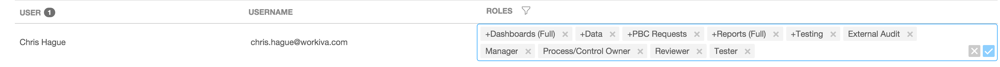

After you've done that, refresh your client. After the refresh you should see more options available on the left-hand navigation : 

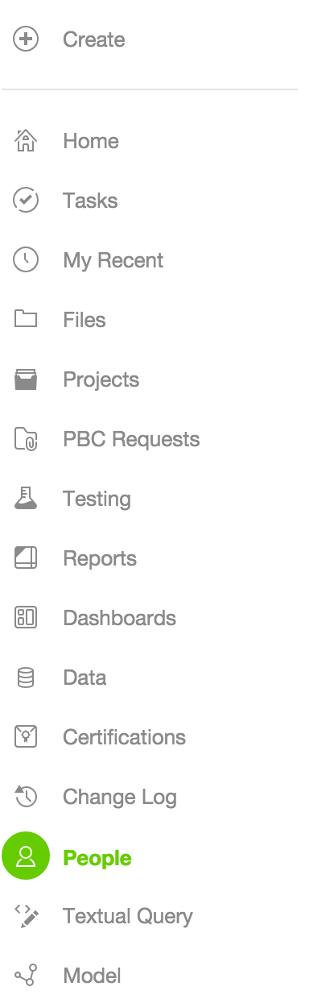

***

## SOX Attachment Creation

#### PBC Request

Assuming you've followed all of the above steps and everything is working as expected, you should be able to create attachments in sox. The first place you can make attachment is in a PBC request. To create a PBC request, click the 'PBC Requests' on the left-hand navigation. Click 'New request' and select 'Population Request' for the type.
 
Make sure your user is the value for the 'Requested by' and the 'Provided by' field. The other entry fields don't matter for our purposes, add any value available in the dropdowns. When you click 'Create Reqeust', a modal will ask you if you'd like to distribute now, click 'send now'. 

Now if you go back to the PBC Requests page, you should see your request listed under 'requested' and you can open it up. Once open, you'll see an attachment panel on the right that you can add attachments to: 
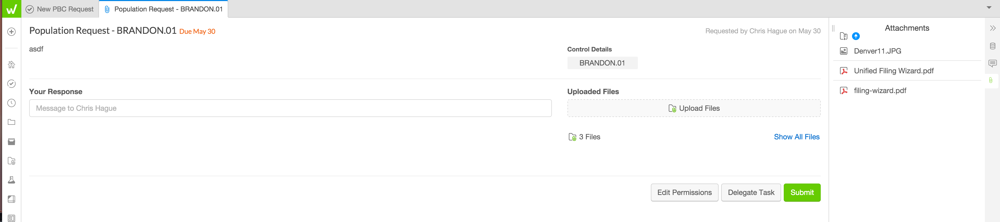

#### Test Form
If you imported the data set provided above in the graph setup instructions, you should be able to navigate to 'Testing' in the lefthand navbar, click 'All Test Forms' and see a test form named `C.05.15`. If you open it and click on the design tab, you can make / re-use attachments by uploading files or by clicking and dragging attachments onto the attribute testing: 
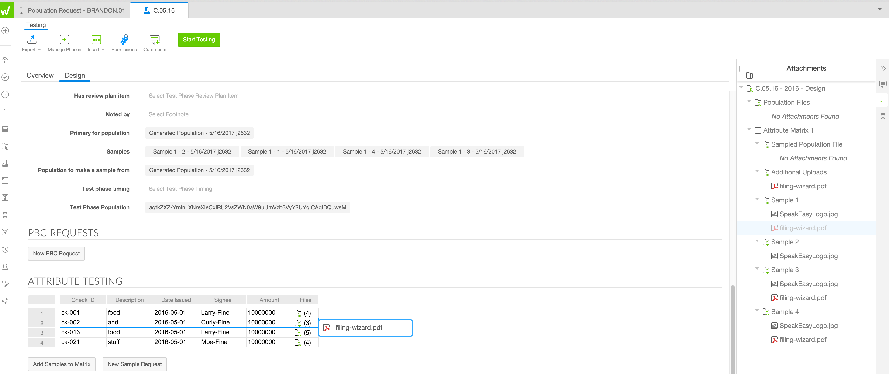

***

## Troubleshooting

Its important to know that SOX containers are all 'inspectable' in their running state. To list all running docker containers enter the following in your terminal: 

`docker ps -a`

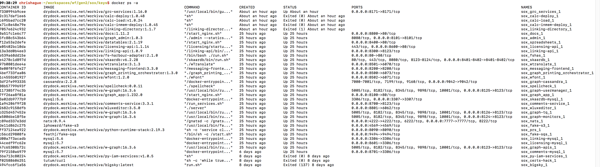

To debug a single container, you can get a dump of its logs as it runs. Most often, you'll want to inspect the graph-api container since its the first place that handles attachment events (once the bigsky backend sends the event along). 

`docker logs -f sox_graph-apis_1'`
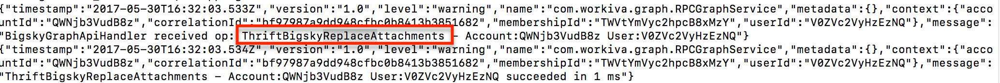


Lastly, if your sox app gets in an un-repairable state you can reset your docker images to force it to pull fresh images: 

```bash
docker system prune
docker run --rm -it --privileged --pid=host walkerlee/nsenter -t 1 -m -u -i -n fstrim /var
docker run --rm -v /var/run/docker.sock:/var/run/docker.sock -v /etc:/etc:ro spotify/docker-gc
```
  


 
