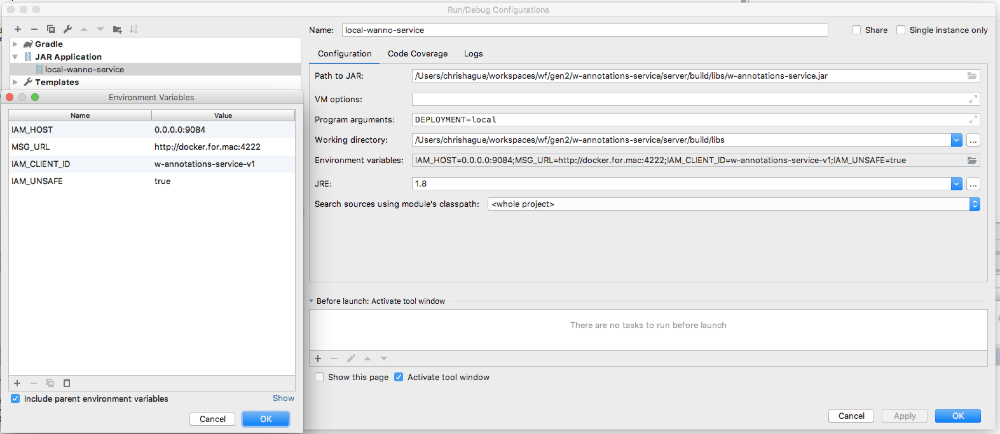

# Building and Running in Spreadsheets

## Install dependencies

#### Download w_attachments_client:
```bash
$ git clone git@github.com:Workiva/w_attachments_client.git
```

#### Set up SkaarDB:
Follow the instructions for installing and setting up [SkaarDB](https://github.com/Workiva/skaardb/blob/master/README.md)
Note that SkaarDB should be set up in your GOPATH

#### Set up CPL:
Follow the instructions for setting up [CPL](https://github.com/Workiva/skaardb/blob/master/cpl/README.md)

#### Set up Datatables:
Follow the instructions for getting [datatables running locally](https://github.com/Workiva/datatables/blob/master/doc/build_run.md)
add the paulankenman-wf fork as a remote and fetch
```bash
$ git remote add paul git@github.com:paulankenman-wf/datatables.git
$ git fetch paul
```
checkout the `attachments_integration` branch from said fork.
```bash
$ git checkout paul/attachments_integration
```

* Note that the use of the branch paulankenman-wf/attachments-integration is temporary and these instructions should be
revised upon this integration branch's merge to datatables/master.

## Run

#### Run CPL:
Navigate to your skaardb/cpl directory in terminal and run the command:
```bash
./launch_local.sh -features=annotations
```
leave this running in a terminal tab for the following steps.

#### Run datatables:
`pub get` from datatables root directory.
`pub get` from datatables/app.
`ddev serve` from within the app directory, or `ddev serve --web-compiler=dart2js` for chrome.

#### Navigate
navigate to `localhost:8080/?mockAuth=true`
note that the mockAuth=true parameter causes the app to redirect to the CPL.
From there, create a spreadsheet and test the use of the attachments panel in a spreadsheet.

## Running w-annotations-service locally

Use the following command to start w-annotations-service locally:
```bash
w-annotations-service/server/build/libs$ export MSG_URL=http://docker.for.mac:4222 & DEPLOYMENT=local java -jar w-annotations-service.jar
```

CPL will still need to be run, use the following command to run CPL for this scenario:
```bash
./launch_local.sh -features=eva-client-service
```

Note the following settings for running the container from within IntelliJ:

